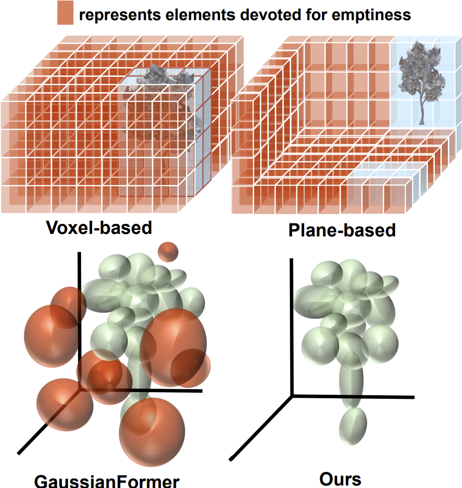
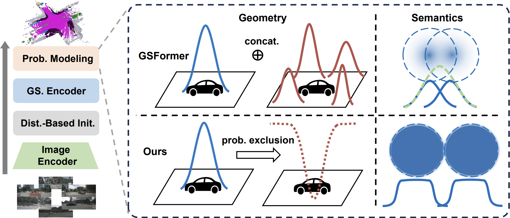

<!-- # Towards building an object-centric autonomous driving system based on Gaussians -->


We build object-centric autonomous driving systems based on Gaussians!

This repository contains the implementation of the following methods. 

> **GaussianFormer: Scene as Gaussians for Vision-Based 3D Semantic Occupancy Prediction**<br>
> [Yuanhui Huang](https://huang-yh.github.io/), [Wenzhao Zheng](https://wzzheng.net/)<sup>*</sup>, [Yunpeng Zhang](https://scholar.google.com/citations?user=UgadGL8AAAAJ&hl=zh-CN&oi=ao), [Jie Zhou](https://scholar.google.com/citations?user=6a79aPwAAAAJ&hl=en&authuser=1), [Jiwen Lu](http://ivg.au.tsinghua.edu.cn/Jiwen_Lu/)<sup>+</sup><br>
> European Conference on Computer Vision (**ECCV**), 2024<br>
> [Paper](https://arxiv.org/abs/2405.17429)  | [Project Page](https://wzzheng.net/GaussianFormer) 

> **GaussianFormer-2:Probabilistic Gaussian Superposition for Efficient 3D Occupancy Prediction**<br>
> [Yuanhui Huang](https://huang-yh.github.io/), [Amonnut Thammatadatrakoon](https://www.linkedin.com/in/amonnut-thammatadatrakoon-aa2a37269?utm_source=share&utm_campaign=share_via&utm_content=profile&utm_medium=android_app), [Wenzhao Zheng](https://wzzheng.net/)<sup>*</sup>, [Yunpeng Zhang](https://scholar.google.com/citations?user=UgadGL8AAAAJ&hl=zh-CN&oi=ao), Dalong Du, [Jiwen Lu](http://ivg.au.tsinghua.edu.cn/Jiwen_Lu/)<br>
> [Paper](http://arxiv.org/abs/2412.04384)

> <sup>*</sup> Project leader. <sup>+</sup> Corresponding author.

## News.
- **[2024/12/05]** GaussianFormer-2 code release.
- **[2024/09/30]** Occupancy and Gaussian visualization code release. 
- **[2024/09/12]** Training code release.
- **[2024/09/05]** An updated version of GaussianFormer modeling only the occupied area.
- **[2024/09/05]** Model weights and evaluation code release.
- **[2024/07/01]** GaussianFormer is accepted to ECCV24!
- **[2024/05/28]** Paper released on [arXiv](https://arxiv.org/abs/2405.17429).
- **[2024/05/28]** Demo release.

## GaussianFormer


GaussianFormer proposes the 3D semantic Gaussians as **a more efficient object-centric** representation for driving scenes compared with 3D occupancy.  


Considering the universal approximating ability of Gaussian mixture, we propose an object-centric 3D semantic Gaussian representation to describe the fine-grained structure of 3D scenes without the use of dense grids. We propose a GaussianFormer model consisting of sparse convolution and cross-attention to efficiently transform 2D images into 3D Gaussian representations. To generate dense 3D occupancy, we design a Gaussian-to-voxel splatting module that can be efficiently implemented with CUDA. With comparable performance, our GaussianFormer reduces memory consumption of existing 3D occupancy prediction methods by 75.2% - 82.2%.


## GaussianFormer-2


<!--  -->
<p align = "center"> 

</p>

We propose a probabilistic Gaussian superposition model which interprets each Gaussian as a probability distribution of its neighborhood being occupied and conforms to probabilistic multiplication to derive the overall geometry.
Furthermore, we adopt the exact Gaussian mixture model for semantics calculation to avoid unnecessary overlapping of Gaussians.
To effectively initialize Gaussians in non-empty region, we design a distribution-based initialization module which learns the pixel-aligned occupancy distribution instead of the depth of surfaces.
We conduct extensive experiments on nuScenes and KITTI-360 datasets and our GaussianFormer-2 achieves state-of-the-art performance with high efficiency.



## Getting Started

### Installation
Follow instructions [HERE](docs/installation.md) to prepare the environment.
<!-- The environment is almost the same as [SelfOcc](https://github.com/huang-yh/SelfOcc) except for two additional CUDA operations.

```
1. Follow instructions in SelfOcc to prepare the environment. Not that we do not need packages related to NeRF, so feel safe to skip them.
2. cd model/encoder/gaussian_encoder/ops && pip install -e .  # deformable cross attention with image features
3. cd model/head/localagg && pip install -e .  # Gaussian-to-Voxel splatting
``` -->

### Data Preparation
1. Download nuScenes V1.0 full dataset data [HERE](https://www.nuscenes.org/download).

2. Download the occupancy annotations from SurroundOcc [HERE](https://github.com/weiyithu/SurroundOcc) and unzip it.

3. Download pkl files [HERE](https://cloud.tsinghua.edu.cn/d/bb96379a3e46442c8898/).

**Folder structure**
```
GaussianFormer
├── ...
├── data/
│   ├── nuscenes/
│   │   ├── maps/
│   │   ├── samples/
│   │   ├── sweeps/
│   │   ├── v1.0-test/
|   |   ├── v1.0-trainval/
│   ├── nuscenes_cam/
│   │   ├── nuscenes_infos_train_sweeps_occ.pkl
│   │   ├── nuscenes_infos_val_sweeps_occ.pkl
│   │   ├── nuscenes_infos_val_sweeps_lid.pkl
│   ├── surroundocc/
│   │   ├── samples/
│   │   |   ├── xxxxxxxx.pcd.bin.npy
│   │   |   ├── ...
```

### Inference
We provide the following checkpoints trained on the SurroundOcc dataset:

| Name  | Type | #Gaussians | mIoU | Config | Weight |
| :---: | :---: | :---: | :---: | :---: | :---: |
| Baseline | GaussianFormer | 144000 | 19.10 | [config](config/nuscenes_gs144000.py) | [weight](https://cloud.tsinghua.edu.cn/seafhttp/files/b751f8f7-9a28-4be7-aa4e-385c4349f1b0/state_dict.pth) |
| NonEmpty | GaussianFormer | 25600  | 19.31 | [config](config/nuscenes_gs25600_solid.py) | [weight](https://cloud.tsinghua.edu.cn/f/d1766fff8ad74756920b/?dl=1) |
| Prob-64  | GaussianFormer-2 | 6400 | 20.04 | [config](config/prob/nuscenes_gs6400.py) | [weight](https://cloud.tsinghua.edu.cn/f/d041974bd900419fb141/?dl=1) |
| Prob-128 | GaussianFormer-2 | 12800 | 20.08 | [config](config/prob/nuscenes_gs12800.py) | [weight](https://cloud.tsinghua.edu.cn/f/b6038dca93574244ad57/?dl=1) |
| Prob-256 | GaussianFormer-2 | 25600 | 20.33 | [config](config/prob/nuscenes_gs25600.py) | [weight](https://cloud.tsinghua.edu.cn/f/e30c9c92e4344783a7de/?dl=1) |


```
python eval.py --py-config config/xxxx.py --work-dir out/xxxx/ --resume-from out/xxxx/state_dict.pth
```

### Train

Download the pretrained weights for the image backbone [HERE](https://github.com/zhiqi-li/storage/releases/download/v1.0/r101_dcn_fcos3d_pretrain.pth) and put it inside ckpts.
```bash
python train.py --py-config config/xxxx.py --work-dir out/xxxx
```

Stay tuned for more exciting work and models!🤗

### Visualize
Install packages for visualization according to the [documentation](docs/installation.md). Here is an example command where you can change --num-samples and --vis-index.
```bash
CUDA_VISIBLE_DEVICES=0 python visualize.py --py-config config/nuscenes_gs25600_solid.py --work-dir out/nuscenes_gs25600_solid --resume-from out/nuscenes_gs25600_solid/state_dict.pth --vis-occ --vis-gaussian --num-samples 3 --model-type base
```

## Related Projects

Our work is inspired by these excellent open-sourced repos:
[TPVFormer](https://github.com/wzzheng/TPVFormer)
[PointOcc](https://github.com/wzzheng/PointOcc)
[SelfOcc](https://github.com/huang-yh/SelfOcc)
[SurroundOcc](https://github.com/weiyithu/SurroundOcc) 
[OccFormer](https://github.com/zhangyp15/OccFormer)
[BEVFormer](https://github.com/fundamentalvision/BEVFormer)

Our code is originally based on [Sparse4D](https://github.com/HorizonRobotics/Sparse4D) and migrated to the general framework of [SelfOcc](https://github.com/huang-yh/SelfOcc).

## Citation

If you find this project helpful, please consider citing the following paper:
```
@article{huang2024gaussian,
    title={GaussianFormer: Scene as Gaussians for Vision-Based 3D Semantic Occupancy Prediction},
    author={Huang, Yuanhui and Zheng, Wenzhao and Zhang, Yunpeng and Zhou, Jie and Lu, Jiwen},
    journal={arXiv preprint arXiv:2405.17429},
    year={2024}
}
@article{huang2024probabilisticgaussiansuperpositionefficient,
      title={GaussianFormer-2: Probabilistic Gaussian Superposition for Efficient 3D Occupancy Prediction}, 
      author={Yuanhui Huang and Amonnut Thammatadatrakoon and Wenzhao Zheng and Yunpeng Zhang and Dalong Du and Jiwen Lu},
      journal={arXiv preprint arXiv:2412.04384},
      year={2024}
}
```
